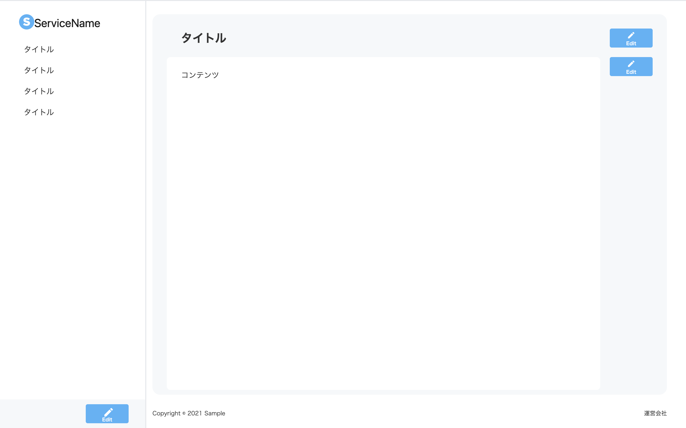

# 目次
- [完成品](#complete)
  - [PC１３インチの場合の対応](#pc)
- [使用技術](#tech)
  - [選定理由](#reason)
- [課題作成の過程(設計)](#hardship)
  - [FactoryMethod化](#factory)
    - [この構成のメリット](#melit)
    - [Repository層の説明](#repository)
    - [Model層の説明](#model)
    - [API-Clientの説明](#api-client)
    - [Factory層の説明](#fac-method)
- [レートリミッターについて](#rait)
- [開発ログ](#log)

<h2 id="complete">完成品</h2>


- 動作要件
  バックエンド（nest.js）側で
  ```yarn start```（localhost:3000）
  をした後、フロントエンド側で
  ```npm start```(localhost:3001)
  を行う

<h3 id="pc">パソコンが13インチの場合、下記の対応する必要がある</h3>

- 下記のように、下面が見えない


- ツールバーをオフにする


- そしたら全面見えるようになる


  

<h2 id="tech">使用技術</h2>

- React
- TypeScript
- TailwindCSS
- prettier
- ESlint
- zustand
- react-query

<h3 id="reason">選定理由</h3>

元々、Next.js(TypeScript)で課題作成を行おうと思っていましたが、今回の課題はSPAだったので、シンプルなReact(TypeScript)で行いました。

<h2 id="hardship">課題作成の過程（設計及び中間文書）</h2>

<h3 id="factory">api通信手法を「Repository層」「Model層」「API-Client」「FactoryMethod」に分けて行う。(FactoryMethod化)</h3>

```
src/
 |-api
  |-factory
  |-model
  |-repository
  |-api-client.ts
```


<h4 id="melit">この構成のメリット</h4>

- モジュール化された設計
- テストの容易性
- APIクライエントの再利用
- 例外処理の一元化

<h4 id="repository">「Repository層」</h4>

Repository層は、フロント側でのAPI通信のための処理を定義する層になっています。
次に紹介するModel層とAPI-Clinetを仲介する役割持っています。具体的な責務としては、
- API-Clinetを使ったAPI通信処理の実装
- API-Clinetから取得したデータをModel層で定義した型に変換する実装
- API通信に関する例外処理の実装

<h4 id="model">「Model層」</h4>

Model層は、フロント側で扱うデータ型の振る舞いを定義しAPI通信におけるデータの整合性を保つ役割を担っています。

具体的な責務としては

- データの型定義
- データのバリデーションの実装
- クライアント側でのデータの加工や整形の実装
  
<h4 id="api-client">「API-client」</h4>

API-Clientは実際にAPI通信を行うためのコンポーネントであり、axiosを利用してAPI通信を行う。

具体的な責務としては

- HTTPクライアントを使用したAPI通信の処理実装
- 共通で利用するAPI通信に関する例外処理の実装

<h4 id="fac-method">「Fatory層」</h4>

FactoryはModel層内で利用される具体的なインスタンスを生成し、データの整合性を保つ役割を担います。

具体的な責務としては

- インスタンスの生成処理の実装
- インスタンスの生成に必要な型定義の実装


<h2 id="rait">レートリミッターについて</h2>

- 今回バックエンド側でレート制限がされていないと考えれられます（もしかしたら今回の課題のメインテーマ？）。そのため、webサーバの過負荷対策が行われていないので、その場合のフロントエンド側のベストプラクティスとしては、APIのcacheを行うことだと考えました。
なので、react-queryを用いてcache化を行いました。
```
  return useQuery<ContentType[], Error>({
    queryKey: ['contents'],
    queryFn: getContents,
    staleTime: Infinity,
  })
```
また、Next.jsの場合はSWRを用いて、cache化を行うこともできます。

### では、レートリミッターを置くとしたらどこにおくか？
2点あると思います。

- middlewareとして置く
  
.png)

- backend側で実装する
  
.png)

[draw.ioで作成]

### バックエンド（Nest.js）でのレートリミッター実装方法について
nest.jsではシンプルな記述でレートリミッターを設けることができる。
```
$ npm i --save @nestjs/throttler
```
```
@Module({
  imports: [
    ThrottlerModule.forRoot({
      ttl: 60,// 仮
      limit: 10,// 仮
    }),
  ],
})
export class AppModule {}
```

<h2 id="log">開発ログ</h2>

- 2023/09/09
  全体の仕様の理解、技術選定
  ....1h

- 2023/09/11
  swaggerやpostmanを使用し、apiの確認、
  及び実装
  ....3h

- 2023/09/12
  機能実装
  ....2h

- 2023/09/13
  レイアウト調整及びドキュメント作成
  ....1h

- 2023/09/14
  リファクタリング及びドキュメント調整
  ....1h
  - 合計　8h

